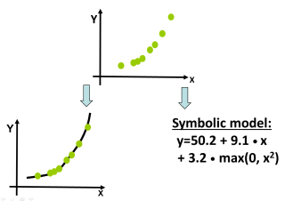

# FFX 2011 

## About the code

This is the original FFX code, from 2011 (v1.3). 

- [FFX.py](FFX.py) implements FFX algorithm, and [runffx.py](runffx.py) is a testing toolkit.  [License](FFX_license.txt).
- Dependencies - python (2.5, 2.6, and 2.7 work), numpy/skipy (0.9.0 works), scikits.learn (0.8 works)

(Alt open source code: [natekupp/ffx](https://github.com/natekupp/ffx). Derived from v1.3. 2012-2021. 🙏 Nathan Kupp.)

## About FFX

(From http://www.trent.st/ffx/)

FFX is a technique for symbolic regression, to induce whitebox models given X/y training data. It does Fast Function Extraction. It is:

- Fast - runtime 5-60 seconds, depending on problem size (1GHz cpu)
- Scalable - 1000 input variables, no problem!
- Deterministic - no need to "hope and pray".

If you ignore the whitebox-model aspect, FFX can be viewed as a regression tool. It's been used this way for thousands of industrial problems with 100K+ input variables. It can also be used as a classifier (FFXC), by wrapping the output with a logistic map. 

The original FFX project work was 2011-2013. It was embedded in Solido software and since then,  used successfully on thousands of industrial problems.

**Technical details:**
- AI-oriented description [Slides](http://www.trent.st/content/2011-GPTP-FFX-slides.pdf) [Paper](http://www.trent.st/content/2011-GPTP-FFX-paper.pdf)
- Circuits-oriented description [Slides](http://www.trent.st/content/2011-CICC-FFX-slides.ppt) [Paper](http://www.trent.st/content/2011-CICC-FFX-paper.pdf)

**Real-world test datasets:**
- 6 Medium-dim. problems [ALL 36K](http://www.trent.st/content/med-dimensional_benchmark_datasets.zip)
- 12 High-dim. problems [Part1 17M](http://www.trent.st/content/high-dimensional_benchmark_datasets_part1.tar.gz) [Part2 14M](http://www.trent.st/content/high-dimensional_benchmark_datasets_part2.tar.gz) [Part3 14M](http://www.trent.st/content/high-dimensional_benchmark_datasets_part3.tar.gz)

**Representative papers:**

- T. McConaghy, FFX: Fast, Scalable, Deterministic Symbolic Regression Technology, Genetic Programming Theory and Practice IX, Edited by R. Riolo, E. Vladislavleva, and J. Moore, Springer, 2011.
- T. McConaghy, High-Dimensional Statistical Modeling and Analysis of Custom Integrated Circuits, Proc. Custom Integrated Circuits Conference, Sept. 2011
